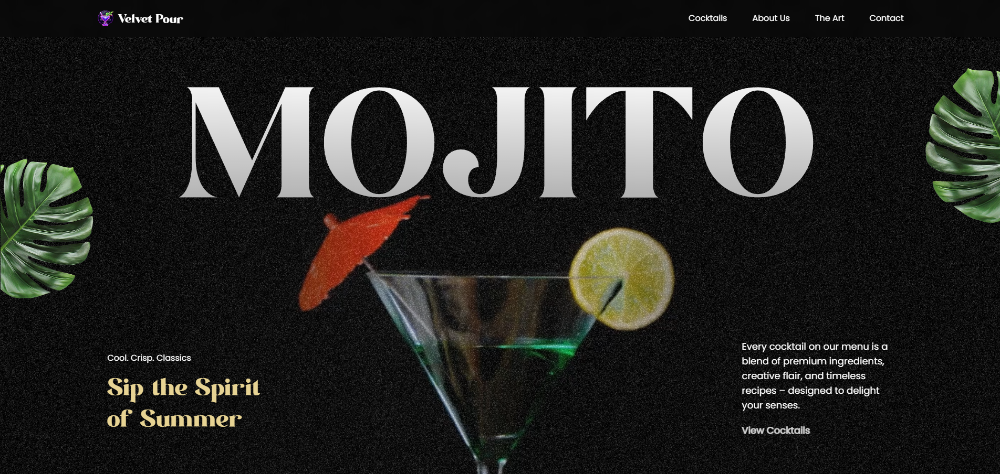

# MOJITO – GSAP Learning Project




A cocktail-themed website built to explore **GSAP animations**.  
[Live Demo Here](https://gsap-mojito-project.vercel.app/)

---

## Features
- 🎥 **Scroll-triggered video playback**  
- ✨ **Split text animations** (chars/words/lines)  
- 📦 **Element entrance effects** (fade/slide on scroll)  
- ➡️ **Arrow-controlled menu navigation**  
- 🖼️ **Masked image scaling effect** with scroll  

---

## Installation
```bash
git clone https://github.com/Hadi87s/VelvetPour
cd your-project-directory
npm install
npm run dev
